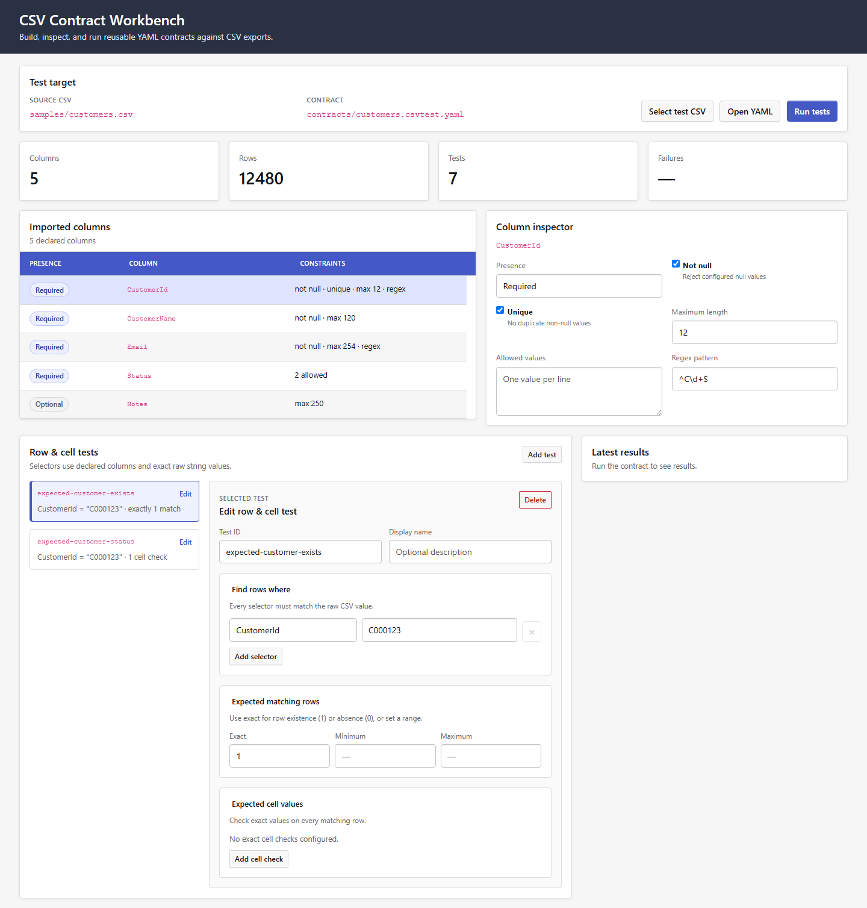
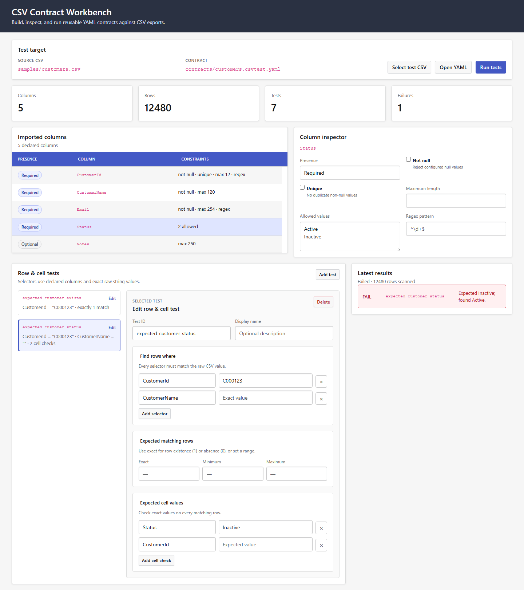

# CSV Contract Workbench

Define reusable YAML contracts for CSV files, edit them visually in VS Code, and run the same validations interactively or in unattended workflows.

## Build contracts visually

Create a contract from a CSV to start with its real column names, then set presence and data-quality rules from the workbench. The YAML file remains the source of truth and can always be edited directly with schema-aware IntelliSense.

*Configure required and optional columns, null handling, uniqueness, lengths, allowed values, and regular expressions.*

## See failures in context

Run a contract against a CSV and review file, column, row, and cell failures alongside the rules that produced them.

*Inspect the selected column and the latest validation result in one workspace.*

## What you can validate

- Expected and optional columns, with control over undeclared extras
- Row and column counts
- Null values, uniqueness, minimum and maximum lengths
- Allowed values and regular-expression matches
- Composite identities across multiple columns
- Required or forbidden rows selected by exact values
- Exact cell values for selected rows
- Raw string values such as identifiers with leading zeroes

## Get started

1. Install **CSV Contract Workbench** from the VS Code Marketplace.
2. Run **CSV Contract: Create Contract from CSV** from the Command Palette.
3. Review the generated `*.csvtest.yaml` file in the visual workbench or YAML editor.
4. Select **Select test CSV**, choose the CSV to validate, and then select **Run tests**.

Generated contracts are deliberately conservative: they capture the observed columns and include sample row and cell assertions without guessing business rules. You decide which columns are required, unique, nullable, length-limited, or restricted to known values.

## Reuse the same contract

Contracts are plain YAML files designed to live beside the data workflow they protect. A broad schema contract and focused spot-check contracts can be applied to the same CSV.

The included Node CLI and PowerShell wrapper use a streaming validator for unattended runs. Compatible contracts share one CSV pass, diagnostics remain bounded, and exact uniqueness checks spill to temporary disk instead of retaining the entire CSV in memory.

## Local by design

CSV contents and contracts are processed locally. CSV Contract Workbench does not upload validation data to a hosted service.

## License

The extension code and documentation are licensed under Apache-2.0. CSV Contract Workbench and its product marks are Incursa brand assets and are not granted under that license.
